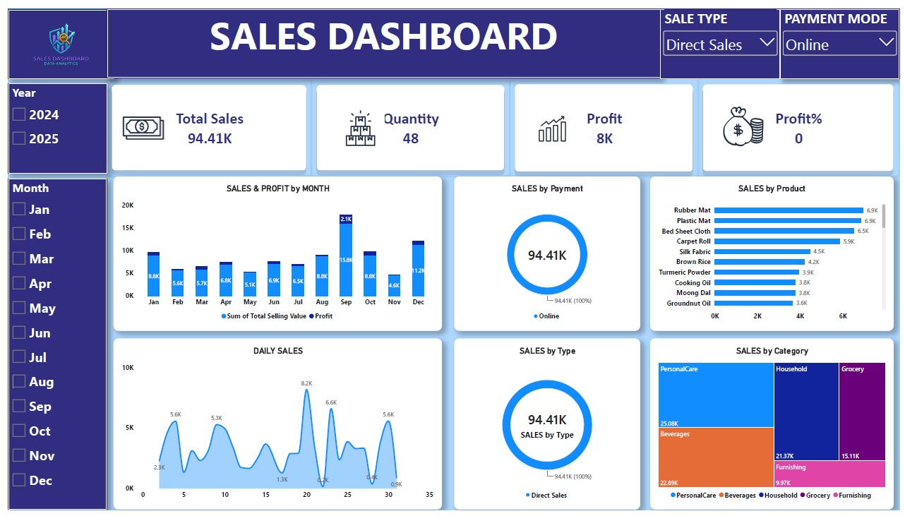

# 📊 Sales Performance & Profit Analytics Dashboard

Interactive sales dashboard built using **Microsoft Power BI Desktop** to analyze revenue trends, profit margins, product categories, and transaction channels.

## 📌 Project Overview
- **Objective**: Monitor retail sales performance across multiple channels and product categories.
- **Data Coverage**: 527 transactions spanning 2024–2025 across 44 retail products.
- **Dataset Structure**:
  - `Input Data`: Transaction dates, product IDs, quantities, sale types, payment modes, and discounts.
  - `Master Data`: Product catalog, categories, units of measure (UOM), buying prices, and selling prices.

## 🎯 Key Metrics & Visuals
- **Core KPI**: Total Sales, Profit, and Quantity Sold.
- **Sales & Profit by Month**: Bar and line combo chart tracking monthly revenue and margins.
- **Daily Sales Trend**: Area chart showing sales fluctuations over time.
- **Sales by Category**: Treemap highlighting revenue distribution across Grocery, Household, Beverages, Personal Care, and Furnishing.
- **Channel & Payment Breakdown**: Donut and pie charts detailing Direct Sales vs. Online/Wholesaler and Cash vs. Online payments.
- **Interactive Slicers**: Dynamic filtering by Year (2024, 2025), Month, Sale Type, and Payment Mode.

## 🛠️ Tech Stack & Design System
- **Tool**: Microsoft Power BI Desktop
- **Data Source**: Microsoft Excel (`Sales-Dashboard- Data.xlsx`)
- **Theme**: Modern Dark Plum palette (`#312E81`, `#1E293B`) with high-contrast coral, cyan, and violet visual accents.

## 🚀 How to Run Locally
1. Clone or download this repository.
2. Ensure you have [Power BI Desktop](https://powerbi.microsoft.com/desktop/) installed.
3. Open the `.pbix` file to interact with all slicers, tooltips, and cross-filtering features.
